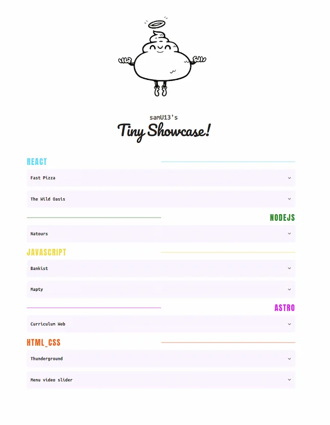

<div align="center">

<h1>
    <em>Tiny Show</em> 📋
</h1>
<p>
    Una elegante plataforma para mostrar tus proyectos, creada con Astro y React.
    <br>
    Simplemente actualiza el archivo <code>projects.json</code> para gestionar tu portafolio.
</p>

<strong><a href="https://tiny-showcase.vercel.app/" target="_blank">🔗 DEMO EN VIVO</a></strong>

</div>

<div align="center">
    <a href="#-características">
        Características
    </a>
    <span>&nbsp;✦&nbsp;</span>
    <a href="#-empezar">
        Empezar
    </a>
    <span>&nbsp;✦&nbsp;</span>
    <a href="#-stack-tecnológico">
        Stack
    </a>
    <span>&nbsp;✦&nbsp;</span>
    <a href="#-comandos">
        Comandos
    </a>
    <span>&nbsp;✦&nbsp;</span>
    <a href="#-personalización">
        Personalización
    </a>
    <span>&nbsp;✦&nbsp;</span>
    <a href="#-despliegue">
        Despliegue
    </a>
</div>

<p></p>

<div align="center">

[](https://astro.build)



</div>

## ✨ Características

- **Fácil de mantener** - Actualiza solo el archivo `projects.json` para añadir o modificar proyectos
- **Rendimiento optimizado** - Construido con Astro para una carga rápida y una experiencia fluida
- **Componentes reutilizables** - Creado con React y Shadcn para una UI moderna y responsive
- **Personalizable** - Fácilmente adaptable a tus necesidades y estilo personal
- **SEO amigable** - Estructura optimizada para buscadores
- **Despliegue sencillo** - Compatible con plataformas como Vercel, Netlify o GitHub Pages

## 🚀 Stack Tecnológico

- [**Astro**](https://astro.build/) - El framework web de la nueva época, optimizado para sitios con contenido
- [**React**](https://es.react.dev/) - Biblioteca de JavaScript para construir interfaces de usuario
- [**Shadcn**](https://ui.shadcn.com/) - Librería de componentes reutilizables y accesibles
- [**TypeScript**](https://www.typescriptlang.org/) - JavaScript con sintaxis de tipado estático
- [**Tailwind CSS**](https://tailwindcss.com/) - Framework CSS para diseño rápido y responsivo

## 🏁 Empezar

### 1. Usa este [repositorio](https://github.com/samuhlo/tiny-showcase) como _template_

- Se recomienda [pnpm](https://pnpm.io/installation) como gestor de dependencias:

```bash
# Activa pnpm en MacOS, WSL & Linux:
corepack enable
corepack prepare pnpm@latest --activate

# Inicializa el proyecto
pnpm create astro@latest -- --template samU13/tiny-Show
```

### 2. Instala las dependencias

```bash
# Navega al directorio del proyecto
cd tiny-Show

# Instala las dependencias
pnpm install
```

### 3. Añade tu contenido:

Edita el archivo `projects.json` para crear la lista de proyectos personalizada:

```json
[
  {
    "title": "Mi Proyecto",
    "description": "Descripción de mi proyecto",
    "languages": ["javascript", "css", "html"],
    "image": "/ruta/a/imagen.webp",
    "url": "https://miproyecto.com",
    "github": "https://github.com/usuario/proyecto"
  }
]
```

### 4. Lanza el servidor de desarrollo:

```bash
pnpm dev
```

Abre [**http://localhost:4321**](http://localhost:4321/) en tu navegador para ver el resultado.

## 💻 Comandos

| Comando        | Acción                                                                       |
| :------------- | :--------------------------------------------------------------------------- |
| `pnpm dev`     | Lanza un servidor de desarrollo local en `localhost:4321`.                   |
| `pnpm build`   | Comprueba posibles errores y hace un empaquetado de producción en `./dist/`. |
| `pnpm preview` | Vista previa local del build de producción en `localhost:4321`.              |

## 🎨 Personalización

### Colores de lenguajes

Edita la constante `languageColors` en `src/components/ProjectCard.astro` para cambiar los colores asociados a cada lenguaje de programación:

```typescript
const languageColors = {
  javascript: "#f1e05a",
  typescript: "#3178c6",
  // Añade más lenguajes según necesites
};
```

### Estilo y temas

Modifica los archivos en `src/styles/` para personalizar la apariencia general del sitio.

## 🚢 Despliegue

### Vercel

La forma más sencilla de desplegar tu Tiny Show es usando [Vercel](https://vercel.com):

1. Sube tu proyecto a GitHub, GitLab o Bitbucket
2. Importa el repositorio en Vercel
3. Vercel detectará automáticamente que es un proyecto Astro
4. ¡Listo! Tu sitio estará disponible en una URL de Vercel

### Otros servicios

También puedes desplegar en otras plataformas como Netlify, GitHub Pages o cualquier hosting que soporte sitios estáticos.

## 📝 Licencia

Este proyecto está bajo la Licencia MIT - consulta el archivo LICENSE para más detalles.

---

<div align="center">
    Creado con ❤️ por <a href="https://github.com/samuhlo">Samu Lo</a>
    <br>
   
</div>
