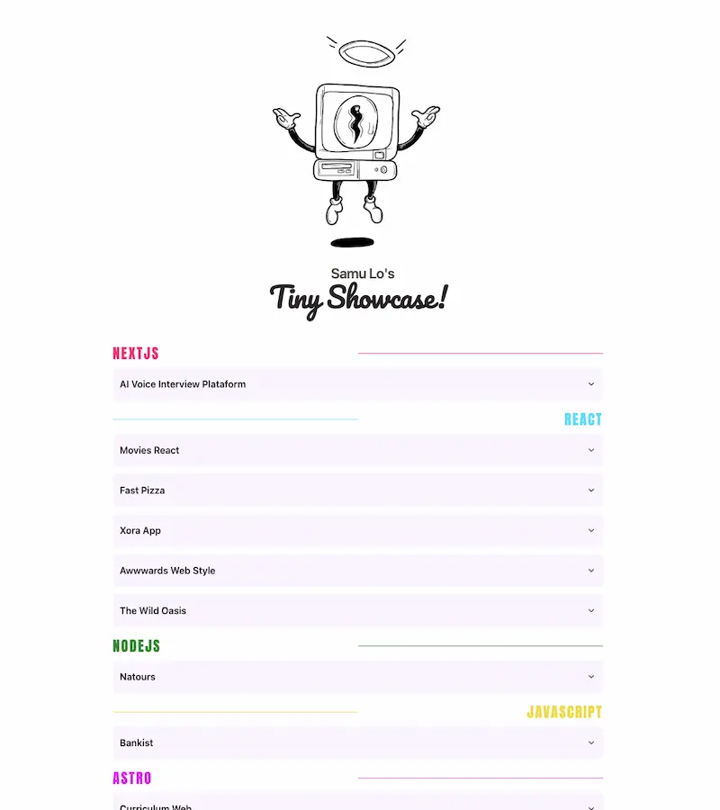

<div align="center">

<h2>
    <em>Tiny Show</em>, un pequeño mostrador de proyectos.
</h2>
<p>
Creado con Astro para solo tener que actualizar el <em>projects.json</em>.
</p>

<strong><a href="https://tiny-Show.vercel.app/">LINK</a></strong>

</div>

<div align="center">
    <a href="#empezar">
        Empezar
    </a>
    <span>&nbsp;✦&nbsp;</span>
    <a href="#comandos">
        Comandos
    </a>
   
</div>

<p></p>

<div align="center">

[](https://astro.build)

</img>

</div>

## Stack

- [**Astro**](https://astro.build/) - El framework web de la nueva época.
- [**React**](https://es.react.dev/) - Biblioteca de Javascript.
- [**Shadcn**](https://ui.shadcn.com/) - Libreria de componentes.

## Empezar

### 1. Usa este [repo](https://github.com/samuhlo/tiny-Show) como _template_ de un proyecto de Astro

- Usa [pnpm](https://pnpm.io/installation) como gestor de dependencias y empaquetador.

```bash
# Activa pnpm en MacOS, WSL & Linux:
corepack enable
corepack prepare pnpm@latest --activate

# Inicializa el proyecto
pnpm create astro@latest -- --template samU13/tiny-Show
```

### 2. Añade tu contenido:

Edita el archivo `projects.json` para crear la lista de proyectos personalizada
<br/>
Edita la `const languageColors` para cambiar los colores de los lenguajes.

### 3. Lanza el servidor de desarrollo:

```bash
# Disfruta del resultado
pnpm dev
```

1. Abre [**http://localhost:4321**](http://localhost:4321/) en tu navegador para ver el resultado

## Comandos

| Comando         | Acción                                                                       |
| :-------------- | :--------------------------------------------------------------------------- |
| `dev` o `start` | Lanza un servidor de desarrollo local en `localhost:4321`.                   |
| `build`         | Comprueba posibles errores y hace un empaquetado de producción en `./dist/`. |
| `preview`       | Vista previa en local `localhost:4321`                                       |

Uso de [**Enchanced-button**](https://github.com/jakobhoeg/enhanced-button)
